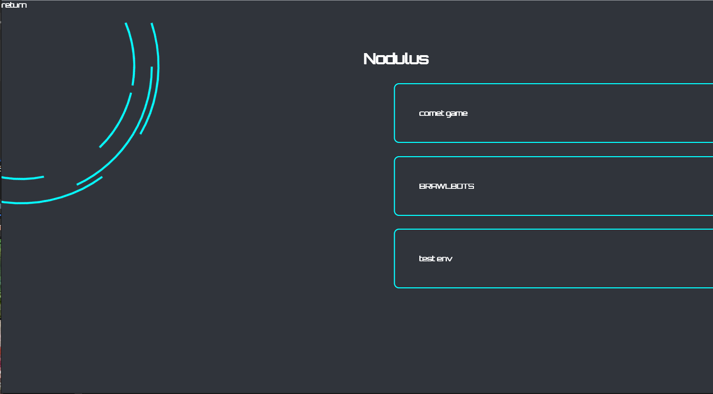
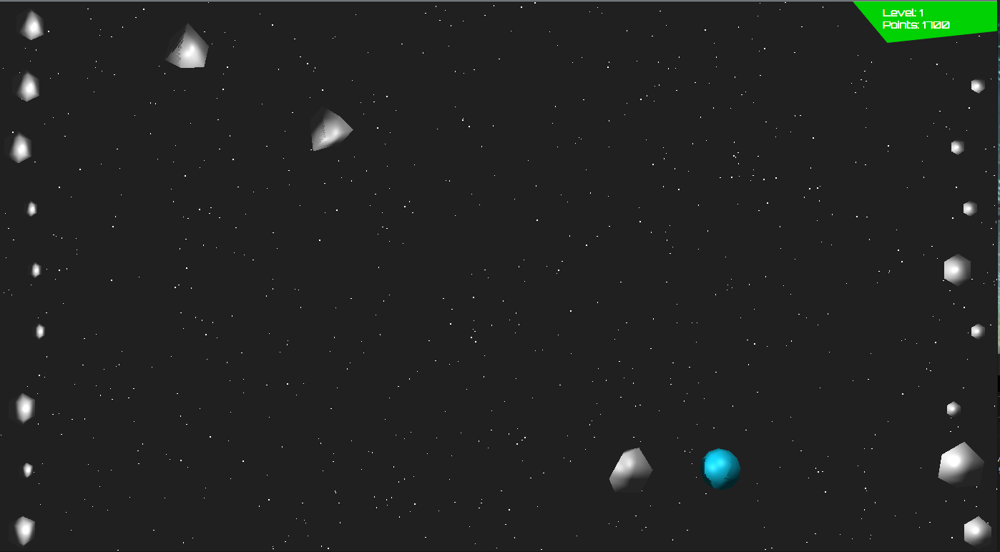

# Nodulus web games
<s>nodulus.netlify.app</s>

Nodulus is a "collection" of web games, primarly hosting comet game, while brawlbots was forgotten in development. 

Homepage
https://the-sides.github.io/nodulus/


Comet Game
https://the-sides.github.io/nodulus/comet.html



Nick Clark is no longer the only player to beat this game!
Congrats to Elizabeth!

While on the express/pug/nodemon BE...
Node version MUST be before 13.xx
Works on 12.22


# create-svelte

Everything you need to build a Svelte project, powered by [`create-svelte`](https://github.com/sveltejs/kit/tree/master/packages/create-svelte).

## Creating a project

If you're seeing this, you've probably already done this step. Congrats!

```bash
# create a new project in the current directory
npm init svelte@next

# create a new project in my-app
npm init svelte@next my-app
```

> Note: the `@next` is temporary

## Developing

Once you've created a project and installed dependencies with `npm install` (or `pnpm install` or `yarn`), start a development server:

```bash
npm run dev

# or start the server and open the app in a new browser tab
npm run dev -- --open
```

## Building

To create a production version of your app:

```bash
npm run build
```

You can preview the production build with `npm run preview`.

> To deploy your app, you may need to install an [adapter](https://kit.svelte.dev/docs/adapters) for your target environment.

